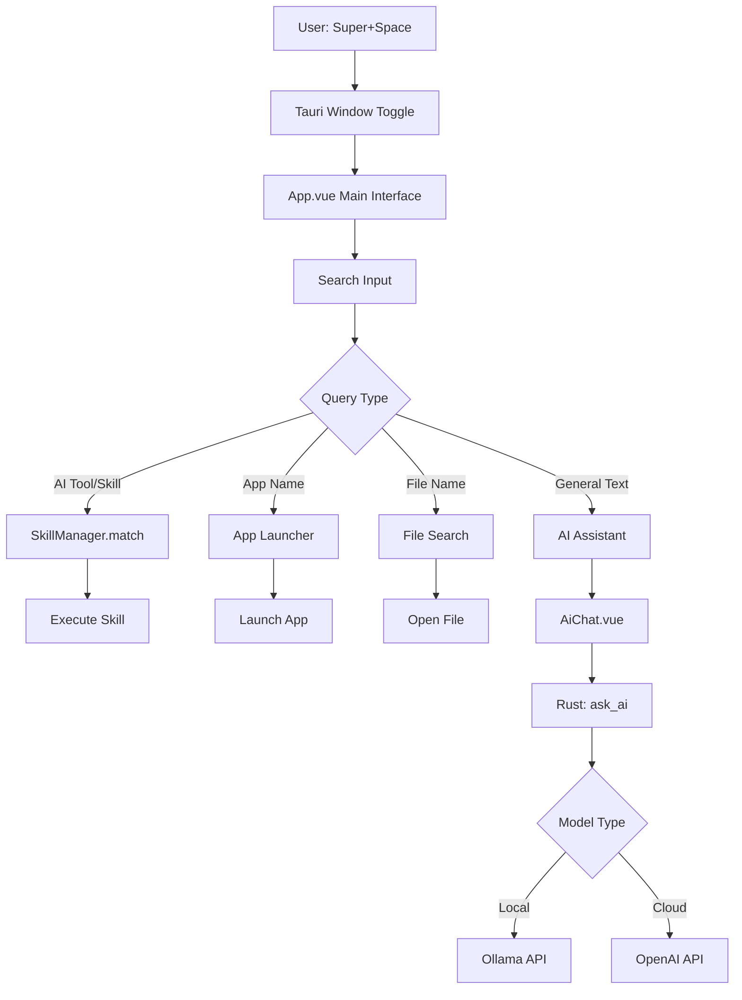
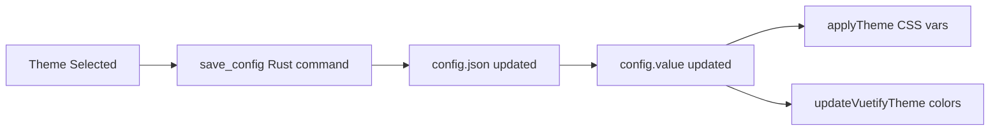

# StratosBar

A modern, minimalist AI-powered command palette for Linux with a Raycast-inspired **Unified Omnibar** interface. Built with Tauri, Vue, and Vuetify.

## 🚀 Quick Overview

**StratosBar** is a native Linux application featuring a sleek, three-state UI that provides instant access to:
- ✨ **Unified Omnibar** - Single dynamic window that adapts to your workflow
- 🤖 **AI Assistant** (Local Ollama & Cloud OpenAI) with clean, avatar-based chat
- 🔍 **Fast File & App Search** with gradient-highlighted AI actions
- 🧮 **Natural Language Calculator** (extensible skills system with emoji icons)
- 🎨 **Modern Design** - Glassmorphism, Inter/JetBrains Mono fonts, smooth animations
- 🌊 **Three UI States** - Idle (minimal), Searching (results), Chatting (AI conversation)
- ⌨️ **Custom Shortcuts** & AI Tools
- 📜 **Script Execution**

**Global Shortcut**: `Super+Space` toggles the command palette


<div align="center">
  <a href="https://youtu.be/YoXBJO-3_Xo">
    
  </a>
</div>

---

## 📋 Table of Contents

- [UI Design](#-ui-design)
- [Tech Stack](#-tech-stack)
- [Features](#-features)
- [Architecture](#-architecture)
- [Project Structure](#-project-structure)
- [Configuration](#-configuration)
- [Development](#-development)
- [Key Components](#-key-components)
- [Skills System](#-skills-system)
- [AI Integration](#-ai-integration)
- [Design System](#-design-system)

---

## 🎨 UI Design

### Unified Omnibar Concept

StratosBar features a **single, dynamic window** that transforms based on your interaction, inspired by modern tools like Raycast.

#### Three UI States

**State 1: Idle (Minimal)**
- Clean, floating search bar
- Inviting placeholder: "🔍 Type a command, search files, or ask AI..."
- "No recent items" message
- Minimal footprint (700px × 100px)

**State 2: Searching (Active)**
- Window expands to show results (700px × 500px)
- **AI Actions** section with electric violet/blue gradient highlights
- Clearly labeled sections (APPLICATIONS, SCRIPTS, FILES)
- Keyboard navigation with visible selection
- Auto-scrolling results list
- Settings accessible via ⚙️ icon

**State 3: Chatting (AI Conversation)**
- Full-height chat interface (700px × 600px)
- **Avatar-based layout** (👤 You, 🤖 AI) - no boxy chat bubbles
- Clean, plain-text messages with typography hierarchy
- Markdown rendering with syntax-highlighted code blocks
- Hover-revealed micro-interactions (📄 Copy, 🔄 Regenerate)
- Back button (← Back) to return to search

### Design Language

- **Glassmorphism**: Subtle transparency with 20px backdrop blur
- **Typography**: Inter (400/500/600) for UI, JetBrains Mono for code
- **No Heavy Borders**: Background color shifts define areas
- **Smooth Animations**: 200-300ms transitions with ease-in-out
- **Generous Spacing**: 24px+ padding for breathing room
- **Gradient Highlights**: AI actions stand out with electric blue/violet
- **Emoji Icons**: 🔢 Calculator, ✏️ Rephrase, 🤖 AI Chat

---

## 🛠 Tech Stack

### Frontend
- **Vue 3** (Composition API with `<script setup>`)
- **Vuetify 3** (Material Design components & theming)
- **Vite** (Build tool & dev server)
- **marked** (Markdown rendering with syntax highlighting)
- **highlight.js** (Code syntax highlighting - Atom One Dark theme)
- **mathjs** (Math expression evaluation)
- **Google Fonts** (Inter for UI, JetBrains Mono for code)

### Backend
- **Tauri 2** (Rust-based native app framework)
- **Rust** (System commands, file search, app launching)
- **Plugins**:
  - `tauri-plugin-global-shortcut` - Global keyboard shortcuts
  - `tauri-plugin-clipboard-manager` - Clipboard operations (Wayland-compatible)
  - `tauri-plugin-single-instance` - Ensure single app instance
  - `tauri-plugin-process` - Process management
  - `tauri-plugin-opener` - File/URL opening

### Design System
- **CSS Variables** - Comprehensive design tokens (colors, spacing, typography, animations)
- **Glassmorphism** - Backdrop blur effects with subtle transparency
- **Custom Animations** - Fade-in, scale-in, smooth transitions
- **Responsive Typography** - Font scale from 0.75rem to 2rem
- **4px Grid System** - Consistent spacing throughout

### Dependencies
- **walkdir** - Recursive directory traversal
- **reqwest** - HTTP client for AI API calls
- **serde/serde_json** - Serialization
- **tokio** - Async runtime
- **open** - Cross-platform file opener

### Runtime Dependencies
- **wmctrl** - For window management on X11
- **wlrctl** - For window management on generic Wayland (optional, if not using Hyprland)


---

## ✨ Features

### 1. Unified Omnibar Interface
- **Three Dynamic States**: Idle → Searching → Chatting
- **Gradient-Highlighted AI Actions**: Electric violet/blue for AI features
- **Keyboard Navigation**: Arrow keys with auto-scroll and visible selection
- **Smooth State Transitions**: 200-300ms animations between states
- **Adaptive Window Sizing**: Automatic height adjustment per state

### 2. AI Assistant
- **Avatar-Based Chat**: Clean 👤/🤖 layout instead of chat bubbles
- **Markdown Rendering**: Formatted responses with code highlighting
- **Hover Micro-Interactions**: Copy & Regenerate buttons appear on hover
- **Context-Aware**: Can access selected text via clipboard
- **Streaming Support**: Real-time response display with typing indicator

### 3. Application Launcher
- Scans `.desktop` files from `/usr/share/applications` and `~/.local/share/applications`
- Icon resolution from `/usr/share/icons`, `/usr/share/pixmaps`
- Fast fuzzy search by app name or executable

### 4. File Search
- Real-time file search with debouncing (300ms)
- Configurable home directory search
- Quick file opening with default applications

### 5. Skills System
- **Emoji Icons**: Clean visual indicators (🔢 for calculator, ✏️ for rephrase)
- **Built-in MathSkill**:
  - Direct math expressions: `5 * 10`, `sqrt(144)`
  - Natural language: `sum of 5 and 10`, `product of 3 and 7`
  - Automatic clipboard copy on execution
- **Easy to Extend**: See [Skills System](#-skills-system)

### 6. Script Execution
- Execute custom scripts from `~/scripts/`
- Direct integration into command palette

### 7. Theme Customization
- **Preset Themes**: Tokyo Night (default), Nord, Catppuccin Mocha
- **Custom Themes**: Full color customization (primary, secondary, background, surface, text)
- **CSS Variables**: Dynamic theme application
- **Persistent**: Theme preferences saved to config

### 8. Settings Management
- Modern, glassmorphic settings UI
- Persistent configuration in `~/.config/stratos-bar/config.json`
- Dynamic Ollama model fetching
- Keyboard shortcuts configuration
- Theme selection & opacity control

---

## 📥 Installation

StratosBar supports multiple Linux distributions. Download the latest release from the [Releases page](https://github.com/yourusername/stratos-bar/releases).

### Ubuntu / Debian
Download the `.deb` package and install:
```bash
sudo apt install ./stratos-bar_0.1.0_amd64.deb
```

### Fedora / RHEL
Download the `.rpm` package and install:
```bash
sudo dnf install ./stratos-bar-0.1.0-1.x86_64.rpm
```

### AppImage (Universal)
Download the `.AppImage` file, make it executable, and run:
```bash
chmod +x stratos-bar_0.1.0_amd64.AppImage
./stratos-bar_0.1.0_amd64.AppImage
```

### Arch Linux
You can build and install directly from the source using the provided `PKGBUILD`.

1. Clone the repository:
   ```bash
   git clone https://github.com/yourusername/stratos-bar.git
   cd stratos-bar
   ```

2. Navigate to the Arch package directory:
   ```bash
   cd pkg/arch
   ```

3. Build and install:
   ```bash
   # Using the convenience script
   ./install.sh

   # OR manually with makepkg
   makepkg -si
   ```

---

## 🏗 Architecture

### Application Flow



### Frontend Architecture

**Main Components:**
1. **App.vue** - Root component with:
   - Search bar & query handling
   - Dynamic window resizing based on content
   - Tool/App/File/Skill matching logic
   - AI chat integration
   
2. **AiChat.vue** - Side panel for AI conversations:
   - Message history
   - Markdown rendering with code highlighting
   - Auto-scroll
   - Copy-to-clipboard for code blocks

3. **Settings.vue** - Configuration interface:
   - AI model selection (local/cloud)
   - Theme customization
   - Shortcut management
   - App launcher configuration

### Backend Architecture (Rust)

**Key Modules:**

1. **config.rs** - Configuration management
   - `AppConfig` struct (API keys, models, tools, shortcuts, theme)
   - `ThemeConfig` struct (color schemes)
   - `ConfigManager` (load/save to `~/.config/stratos-bar/config.json`)

2. **lib.rs** - Tauri commands (invokable from frontend):
   - `list_apps()` - Parse `.desktop` files
   - `launch_app(exec_cmd)` - Execute applications
   - `search_files(query, path)` - File search with WalkDir
   - `list_scripts()` - List scripts from `~/scripts/`
   - `ask_ai(messages)` - Route to Ollama or OpenAI
   - `list_ollama_models()` - Fetch available Ollama models
   - `get_selection_context()` - Get clipboard text (Wayland-compatible)
   - `copy_to_clipboard(text)` - Copy to clipboard (Wayland-compatible)
   - `get_config()` / `save_config(config)` - Config persistence

3. **main.rs** - Entry point with:
   - Global shortcut registration (`Super+Space`)
   - Single instance enforcement
   - Window management

---

## 📁 Project Structure

```
stratos-bar/
├── src/                          # Frontend (Vue)
│   ├── App.vue                   # Main application UI
│   ├── main.js                   # Vue app initialization
│   ├── theme.js                  # CSS theme variable injection
│   ├── components/
│   │   ├── AiChat.vue            # AI chat interface
│   │   └── Settings.vue          # Settings dialog
│   ├── skills/                   # Extensible skills system
│   │   ├── index.js              # Skill manager export
│   │   ├── SkillManager.js       # Skill matching/execution
│   │   └── builtin/
│   │       └── MathSkill.js      # Natural language calculator
│   └── plugins/
│       └── vuetify.js            # Vuetify configuration
│
├── src-tauri/                    # Backend (Rust)
│   ├── src/
│   │   ├── main.rs               # App entry point
│   │   ├── lib.rs                # Tauri commands
│   │   └── config.rs             # Configuration management
│   ├── Cargo.toml                # Rust dependencies
│   └── tauri.conf.json           # Tauri configuration
│
├── package.json                  # Frontend dependencies
├── vite.config.js                # Vite configuration
└── README.md                     # This file
```

---

## ⚙ Configuration

### Config File Location
`~/.config/stratos-bar/config.json`

### Config Structure

```json
{
  "openai_api_key": "sk-...",
  "local_model_url": "http://localhost:11434",
  "preferred_model": "local",
  "ollama_model": "llama3",
  "ai_tools": [
    {
      "id": "rephrase",
      "name": "Rephrase Selection",
      "description": "Improve clarity and grammar",
      "prompt_template": "...",
      "keywords": ["rephrase", "rewrite", "fix"],
      "icon": "mdi-pencil-outline"
    }
  ],
  "shortcuts": {
    "calc": "builtin-math",
    "chat": "app:firefox"
  },
  "theme": {
    "name": "Tokyo Night",
    "primary": "#7aa2f7",
    "secondary": "#bb9af7",
    "background": "#1a1b26",
    "surface": "#24283b",
    "text": "#c0caf5",
    "is_custom": false
  }
}
```

### AI Models

**Local (Ollama)**:
- Requires Ollama running on `localhost:11434`
- Models auto-detected from `/api/tags` endpoint
- Default: `llama3`

**Cloud (OpenAI)**:
- Requires `openai_api_key` in config
- Uses `gpt-4` model
- API calls to `https://api.openai.com/v1/chat/completions`

---

## 💻 Development

### Prerequisites
- Node.js (v18+)
- Rust (latest stable)
- Tauri CLI
- Ollama (optional, for local AI)

### Setup

```bash
# Clone the repository
git clone <repo-url>
cd stratos-bar

# Install frontend dependencies
npm install

# Run development server
npm run dev

# In another terminal, run Tauri dev
npm run tauri dev
```

### Building

```bash
# Build for production
npm run build
npm run tauri build
```

### Development Tips

1. **Hot Reload**: Frontend changes auto-reload with Vite
2. **Rust Changes**: Require Tauri dev restart
3. **Console Logs**: Check DevTools (Ctrl+Shift+I in dev mode)
4. **Wayland Issues**: Set `WEBKIT_DISABLE_COMPOSITING_MODE=1` if needed

---

## 🔑 Key Components

### App.vue (Unified Omnibar)

**Architecture:**
- **Single Component Design**: All UI states managed in one component
- **State Management**: `uiState` ref controls UI mode ('idle', 'searching', 'chatting')
- **Integrated Chat**: Chat functionality built-in (no separate AiChat component)
- **Dynamic Sizing**: Window adapts based on current state

**Key Features:**
- **Three UI States**:
  - Idle: Minimal search bar (100px height)
  - Searching: Expanded results view (500px height)  
  - Chatting: Full chat interface (600px height)
- **Keyboard Navigation**: Arrow keys with `scrollIntoView` for auto-scroll
- **Gradient AI Highlights**: `.ai-action-item` class with electric blue/violet
- **Avatar-Based Chat**: Emoji avatars (👤/🤖) instead of chat bubbles

**Key Computed Properties:**
- `matchedTool` - Determines if query matches a skill, AI tool, or app shortcut
- `filteredApps` - Apps matching search query (limit 5)
- `filteredScripts` - Scripts matching search query
- `totalItems` - Count for keyboard navigation

**Key Methods:**
- `navigateResults(direction)` - Arrow key navigation with auto-scroll
- `executeAction(index)` - Route to appropriate handler (app/skill/AI/file)
- `updateWindowSize()` - Dynamic sizing based on ui State and monitor scaling
- `askAI()` - Transition to chatting state
- `sendChatMessage()` - Handle chat interaction with markdown rendering

### Settings.vue

**Sections:**
1. **General**: Model selection (local/cloud), Ollama model picker
2. **Appearance**: Theme selection (presets + custom colors), opacity
3. **AI Tools**: Custom tools with keywords & prompts
4. **Shortcuts**: Key trigger → tool/app mapping

**Implementation Notes:**
- Dynamic Ollama model fetching on mount
- Color pickers for custom theme creation
- Real-time config persistence via `save_config` command

---

## 🧩 Skills System

### Architecture

Skills are self-contained modules with:
- **Interface**: `id`, `name`, `description`, `icon`, `match(query)`, `execute(data)`
- **Registration**: Via `SkillManager.register(skill)`
- **Matching**: Score-based (0-1), threshold of 0.5 required
- **Execution**: Async, returns result (copied to clipboard automatically)

### Creating a New Skill

```javascript
// src/skills/builtin/MySkill.js
export const MySkill = {
    id: 'builtin-my-skill',
    name: 'My Skill',
    description: 'Does something cool',
    icon: 'mdi-star',

    match(query) {
        // Return { score: 0-1, data: any, preview: string } or null
        if (query.startsWith('cool')) {
            return { 
                score: 0.95, 
                data: { input: query }, 
                preview: 'Processing...' 
            }
        }
        return null
    },

    async execute(data) {
        // Return result to copy to clipboard
        return `Processed: ${data.input}`
    }
}

// src/skills/index.js
import { MySkill } from './builtin/MySkill'
skillManager.register(MySkill)
```

### Built-in MathSkill

**Capabilities:**
- Direct expressions: `2+2`, `sqrt(144)`, `5^3`
- Natural language: `sum of 5 and 10`, `product of 3 and 7`
- Complex: `(5 + 3) * 2`, `sqrt of 144`

**Implementation:**
- Regex-based expression detection
- NLP preprocessing for keyword replacement
- `mathjs` evaluation
- Score: 1.0 for direct math, 0.95 for NLP

---

## 🤖 AI Integration

### Flow

1. User types query
2. `matchedTool` checks for keyword/shortcut match
3. If tool found, substitute `{{selection}}` with clipboard content
4. Send prompt to `ask_ai` Rust command
5. Route to Ollama or OpenAI based on `preferred_model`
6. Display response in AiChat.vue with markdown rendering

### Ollama Integration

**Endpoint**: `POST http://localhost:11434/api/chat`

**Request:**
```json
{
  "model": "llama3",
  "messages": [
    {"role": "user", "content": "Hello"}
  ],
  "stream": false
}
```

### OpenAI Integration

**Endpoint**: `POST https://api.openai.com/v1/chat/completions`

**Request:**
```json
{
  "model": "gpt-4",
  "messages": [
    {"role": "user", "content": "Hello"}
  ]
}
```

### Selection Context

**Wayland-Compatible Clipboard Access:**
- Uses `wl-paste` for Wayland
- Falls back to `xclip` for X11
- Triggered by AI tools with `{{selection}}` placeholder

---

## 🎨 Design System

### Modern UI Architecture

**File**: `/src/styles/design-system.css` - Comprehensive design tokens loaded globally

**Key Features**:
- CSS Variables for all design tokens
- Glassmorphism utilities (`.glass-primary`, `.glass-hover`)
- Animation keyframes (`fade-in`, `scale-in`, `typing`)
- Custom scrollbar styling
- Typography and spacing scales

### Design Tokens

**Typography:**
- Primary: `Inter` (400/500/600) - Clean, modern UI font
- Monospace: `JetBrains Mono` (400) - Code blocks
- Font scale: 0.75rem (xs) → 2rem (2xl)

**Colors** (Tokyo Night default):
```css
--theme-primary: #7aa2f7        /* Electric blue */
--theme-secondary: #bb9af7      /* Violet */  
--theme-background: #1a1b26     /* Dark blue-gray */
--theme-surface: #24283b        /* Surface */
--theme-text: #c0caf5          /* Light text */
--gradient-ai: linear-gradient(135deg, #7aa2f7, #bb9af7)
```

**Spacing (4px grid):** `space-1` (4px) → `space-12` (48px)

**Border Radius:** `radius-sm` (6px) → `radius-2xl` (24px) + `radius-full`

**Animations:**
- Durations: Fast (150ms), Normal (200ms), Slow (300ms)
- Easings: `cubic-bezier(0.4, 0, 0.2, 1)` for smooth motion

### Theme System (Legacy Compatible)

### Architecture

1. **Backend**: `ThemeConfig` struct in `config.rs`
2. **Frontend**: 
   - `theme.js` - Injects CSS variables
   - Vuetify theme API - Applies colors to components
3. **Persistence**: Saved in `config.json`

### Theme Application Flow



### CSS Variables

Set by `theme.js`:
- `--theme-background`
- `--theme-surface`
- `--theme-primary`
- `--theme-secondary`
- `--theme-text`

Used in `App.vue` and `AiChat.vue` styles.

### Preset Themes

1. **Tokyo Night** (default)
   - Primary: `#7aa2f7` (blue)
   - Secondary: `#bb9af7` (purple)
   - Background: `#1a1b26` (dark blue-gray)

2. **Nord**
   - Primary: `#88c0d0` (frost blue)
   - Secondary: `#81a1c1` (polar blue)
   - Background: `#2e3440` (dark gray)

3. **Catppuccin Mocha**
   - Primary: `#89b4fa` (blue)
   - Secondary: `#cba6f7` (mauve)
   - Background: `#1e1e2e` (dark)

---

## 🪟 Window Manager Integration

### Hyprland Configuration

To seamlessly integrate StratosBar with Hyprland, add the following rules to your `hyprland.conf`.

#### 1. Window Rules
These rules ensure the app floats, stays centered, and looks clean without borders.

```ini
# Float the window
windowrulev2 = float, class:^(stratos-bar|StratosBar)$

# Center it on screen
windowrulev2 = center, class:^(stratos-bar|StratosBar)$

# Remove borders
windowrulev2 = noborder, class:^(stratos-bar|StratosBar)$

# Keep it focused and on top (like a launcher should)
windowrulev2 = stayfocused, class:^(stratos-bar|StratosBar)$
windowrulev2 = pin, class:^(stratos-bar|StratosBar)$
```

#### 2. Opacity Control
You can manage the window transparency directly through window rules:

```ini
# Set active and inactive opacity (e.g., 0.9)
windowrulev2 = opacity 0.9 0.9, class:^(stratos-bar|StratosBar)$
```

#### 3. Animations (Optional)
Add a smooth slide-in animation for the launcher:

```ini
# Animation
windowrulev2 = animation slide, class:^(stratos-bar|StratosBar)$

# Dim around the window (optional, makes it pop)
windowrulev2 = dimaround, class:^(stratos-bar|StratosBar)$
```

#### 4. Launch Keybinding
Bind a key (usually Super+Space) to execute the AppImage or binary.

```ini
# Replace with the actual path to your AppImage or binary
bind = $mainMod, SPACE, exec, /path/to/stratos-bar_0.1.0_amd64.AppImage
```

---

## 🔧 Troubleshooting

### Wayland Issues
- **Clipboard**: Ensure `wl-clipboard` is installed
- **Transparency**: Application uses opaque background (transparent mode caused ghosting)

### Ollama Not Found
- Verify Ollama is running: `curl http://localhost:11434/api/tags`
- Check `local_model_url` in config

### Window Not Showing
- Check global shortcut conflicts (Super+Space)
- Verify single instance isn't blocking

### Settings Not Persisting
- Check file permissions: `~/.config/stratos-bar/config.json`
- Verify `save_config` is called after changes

---

## 📝 Future Development Ideas

- [ ] Add more built-in skills (unit conversion, date/time, base conversion)
- [ ] File content preview in search results
- [ ] Browser bookmark integration
- [ ] SSH connection manager
- [ ] Clipboard history
- [x] Window switcher (wmctrl/hyprctl/wlrctl integration)
- [ ] Plugin marketplace for community skills
- [x] Streaming AI responses
- [ ] Multi-language support

---

## 🤝 Contributing

This is a personal project, but suggestions and issues are welcome!

---

## 📄 License

[Add your license here]

---

## 🙏 Acknowledgments

Built with:
- [Tauri](https://tauri.app/) - Rust-based desktop framework
- [Vue](https://vuejs.org/) - Progressive JavaScript framework
- [Vuetify](https://vuetifyjs.com/) - Material Design component library
- [Ollama](https://ollama.ai/) - Local LLM runtime
